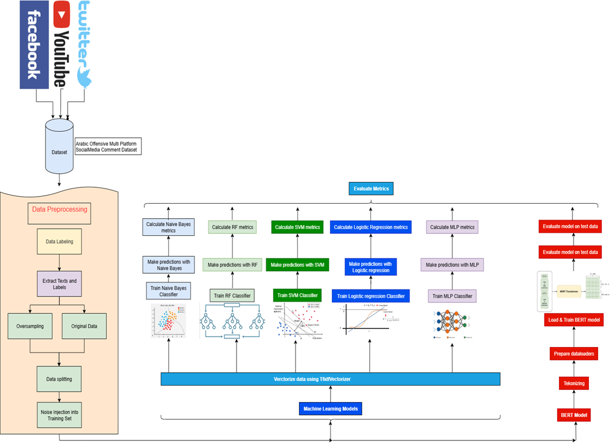

# Evaluating the Effect of Data Poisoning via Label Flipping on Traditional and Deep Learning Models for Arabic Offensive Text Detection

> A reproducible benchmarking framework that evaluates **six classifiers** — including Arabic BERT — on detecting offensive Arabic social-media content, with a systematic study of how **label noise** and **class imbalance** jointly affect model robustness.

---

## Table of Contents

- [Overview](#overview)
- [Methodology](#methodology)
- [Models](#models)
- [Experiment Design](#experiment-design)
- [Project Structure](#project-structure)
- [Requirements](#requirements)
- [Installation](#installation)
- [Dataset](#dataset)
- [Quick Start](#quick-start)
- [Configuration](#configuration)
- [Outputs](#outputs)
- [Error Analysis](#error-analysis)
- [Statistical Testing](#statistical-testing)
- [Results Interpretation](#results-interpretation)
- [Citation](#citation)

---

## Overview

Online Arabic content moderation faces two compounding challenges that are rarely studied together:

1. **Annotation noise** — crowd-sourced labels frequently contain errors; real-world noise rates of 10–30 % are common.
2. **Class imbalance** — offensive posts are naturally outnumbered by benign ones.

This project runs a controlled experiment that crosses both factors:

- **Six noise levels** (0 %, 10 %, …, 50 %) injected into training labels via uniform random flipping.
- **Two training conditions** — original imbalanced data and oversampled balanced data.
- **Five-fold stratified cross-validation repeated five times** (5 × 5 CV) for reliable confidence intervals.
- **Full error analysis** tracking every misclassified sample, false-positive / false-negative patterns, high-confidence mistakes, and per-token linguistic signals.

---

## Methodology

The pipeline diagram below illustrates the end-to-end workflow:



**Data flow summary:**

1. **Data collection** — Arabic comments from Facebook, Twitter, and YouTube are aggregated into a single CSV (`ardata.csv`).
2. **Preprocessing** — Arabic-specific tokenisation (diacritic stripping, alef normalisation, alef maqsura → ya), TF-IDF vectorisation with unigrams + bigrams, 3 000 features.
3. **Balancing (optional)** — `RandomOverSampler` duplicates the minority class on the training split only; the test split is always left untouched.
4. **Noise injection** — a specified fraction of training labels are randomly flipped (0 → 1 or 1 → 0). Flip statistics are recorded for auditing.
5. **Model training** — each of the six classifiers is trained independently on the noisy, (optionally balanced) training fold.
6. **Evaluation** — predictions on the clean test fold are scored across eight metrics; confusion matrices and raw errors are collected.
7. **Aggregation & analysis** — results are averaged over all folds and repeats; Wilcoxon signed-rank tests quantify statistically significant performance drops; 10 error-analysis plots are generated.

---

## Models

| Model | Type | Key Hyperparameters |
|---|---|---|
| **Logistic Regression** | Linear, TF-IDF | SAGA solver, balanced class weight, max_iter=500 |
| **SVM** | Linear kernel, TF-IDF | Linear kernel, probability=True, balanced class weight |
| **Random Forest** | Ensemble, TF-IDF | 50 trees, max_depth=15, balanced class weight |
| **Naive Bayes** | Probabilistic, TF-IDF | Multinomial, default alpha |
| **MLP (Neural Network)** | Feed-forward, TF-IDF | 1 hidden layer (100 units), max_iter=300 |
| **Arabic BERT** | Transformer, raw text | `asafaya/bert-base-arabic`, 5 epochs, lr=3e-5, batch=32 |

- Classical models (all except BERT) receive TF-IDF vectors as input.
- Arabic BERT receives raw Arabic text and uses its own sub-word tokeniser.
- Class-balanced weights are applied to Logistic Regression, SVM, and Random Forest to compensate for residual imbalance.

---

## Experiment Design

```
Noise levels  : [0.0, 0.1, 0.2, 0.3, 0.4, 0.5]
CV strategy   : StratifiedKFold(n_splits=5, shuffle=True) × N_REPEATS=5
Balance modes : unbalanced | balanced (RandomOverSampler, train fold only)
Total runs    : 2 × 6 × 5 × 5 = 300 complete train/test cycles per model
```

**Label noise injection** is applied *after* any oversampling and *only* to the training fold, so test labels remain pristine throughout. For each run, the exact flip statistics (how many 0→1 and 1→0 flips occurred) are logged.

**Error collection** is performed on the first repeat of each fold (configurable via `COLLECT_ERROR_REPEATS`) to keep output file sizes manageable while still giving a representative sample of misclassified examples.

---

## Project Structure

```
.
├── main.py                        ← Entry point; all experiment code
├── ardata.csv                     ← Dataset (see Dataset section)
├── requirements.txt
│
├── results_revised_cv/            ← All outputs (auto-created)
│   ├── aggregated_results_cv.csv  ← Mean ± std per model × noise × balance
│   ├── detailed_runs_cv.csv       ← Raw metric per fold/repeat
│   ├── flip_statistics.csv        ← Noise flip audit log
│   ├── statistical_analysis_cv.csv← Wilcoxon test results
│   ├── noise_macro_f1_*.png       ← Performance vs noise plots
│   │
│   ├── confusion_matrices/        ← CSV + PNG heatmap per condition
│   │
│   └── error_analysis/
│       ├── all_errors_log.csv     ← Every misclassified sample (UTF-8-sig)
│       ├── error_summary.csv      ← FP/FN/confidence summary per condition
│       ├── top_error_tokens.csv   ← Most frequent Arabic tokens in FP & FN
│       ├── examples/              ← Sampled error CSVs per condition
│       ├── per_model/             ← Detailed breakdown CSV per model
│       └── plots/                 ← 10 diagnostic plots
```

---

## Requirements

- Python 3.8+
- CUDA-capable GPU recommended for Arabic BERT (CPU fallback works but is slow)

### Core dependencies

```
pandas
numpy
scikit-learn
imbalanced-learn
scipy
matplotlib
seaborn
nltk
torch
transformers
```

---

## Installation

```bash
# 1. Clone the repository
git clone https://github.com/your-username/arabic-offensive-detection.git
cd arabic-offensive-detection

# 2. Create and activate a virtual environment
python -m venv venv
source venv/bin/activate          # Windows: venv\Scripts\activate

# 3. Install dependencies
pip install -r requirements.txt

# 4. Download NLTK punkt tokeniser (done automatically on first run, or manually)
python -c "import nltk; nltk.download('punkt')"
```

---

## Dataset

The code expects a file named `ardata.csv` in the project root with at least these two columns:

| Column | Description |
|---|---|
| `Comment` | Raw Arabic comment text |
| `Majority_Label` | Either `"Offensive"` or `"Not Offensive"` |

An optional `platform` column (values: `Twitter`, `Facebook`, `YouTube`) is supported for platform-level metadata; if absent it is filled automatically.

**If the file is not found**, the script generates a synthetic 500-row sample so you can verify the pipeline runs end-to-end before supplying real data.

> **Note:** the original dataset (Arabic Offensive Multi-Platform Social Media Comment Dataset) is not redistributed here. Please obtain it from the original source and place it at `ardata.csv`.

---

## Quick Start

```bash
# Run the full 5×5 CV experiment with Arabic BERT
python main.py
```

The script will print progress (`R1F1/5 [1/300] ETA: Xm`) and save all outputs to `results_revised_cv/`.

**Estimated runtime** (5×5 CV, all 6 noise levels, balanced + unbalanced):

| Hardware | Approx. time |
|---|---|
| NVIDIA A100 | ~2–4 hours |
| NVIDIA RTX 3090 | ~4–8 hours |
| CPU only (no BERT) | ~30–60 minutes |

To run without BERT (much faster), set `USE_REAL_BERT = False` in `main.py`.

---

## Configuration

All key settings are at the top of `main.py`:

```python
EXPERIMENT_MODE = 'cv'           # 'cv' for cross-validation
N_REPEATS       = 5              # Repetitions of the full CV
N_SPLITS        = 5              # Folds per repetition
NOISE_LEVELS    = [0.0, 0.1, 0.2, 0.3, 0.4, 0.5]
MASTER_SEED     = 42

COLLECT_ERROR_REPEATS = 1        # Repeats for which errors are logged (set to N_REPEATS for all)
USE_REAL_BERT         = True     # Set False to skip BERT and speed up runs
```

**Arabic BERT hyperparameters** (inside `get_models()`):

```python
ArabicBERTModel(
    model_name    = 'asafaya/bert-base-arabic',
    max_length    = 64,
    batch_size    = 32,
    epochs        = 5,
    learning_rate = 3e-5
)
```

---

## Outputs

### Performance tables

`aggregated_results_cv.csv` — one row per (Balance_Type × Noise_Level × Model):

```
Balance_Type | Noise_Level | Model | accuracy | macro_f1 | macro_precision |
macro_recall | class_f1_offensive | class_f1_not_offensive | roc_auc | pr_auc
```

All metric columns contain `"mean ± std"` strings computed across all folds and repeats.

`detailed_runs_cv.csv` — one row per fold/repeat with raw numeric values (use for custom plots or additional statistical tests).

### Performance plots

Ten PNG files are saved to `results_revised_cv/`:

```
noise_macro_f1_unbalanced_cv.png
noise_macro_f1_balanced_cv.png
noise_roc_auc_unbalanced_cv.png
... (5 metrics × 2 modes = 10 plots)
```

Each plot shows mean performance ± std error bars across noise levels, one line per model.

---

## Error Analysis

After all folds complete, `run_full_error_analysis()` produces the following inside `results_revised_cv/error_analysis/`:

| Output | Description |
|---|---|
| `all_errors_log.csv` | Every misclassified sample with text, true/predicted label, confidence, token length |
| `error_summary.csv` | FP count, FN count, high-confidence error %, mean confidence per condition |
| `top_error_tokens.csv` | Top 20 Arabic tokens appearing in FP errors and FN errors |
| `examples/errors_*.csv` | Up to 50 sampled errors per model × noise × balance condition |
| `per_model/report_*.csv` | Per-noise FP/FN breakdown with top misclassified tokens, per model |

### Diagnostic plots (10 figures)

| # | Filename | What it shows |
|---|---|---|
| 01 | `01_fp_fn_per_model.png` | FP vs FN bar chart per model, unbalanced vs balanced |
| 02 | `02_error_count_vs_noise.png` | Total errors vs noise level, one line per model |
| 03 | `03_confidence_distribution.png` | KDE of model confidence at the point of error |
| 04 | `04_high_confidence_errors_vs_noise.png` | % of errors where the model was very confident (wrong) |
| 05 | `05_token_length_errors.png` | Token-length histograms for FP vs FN errors |
| 06 | `06_FP_heatmap_*.png` | Heatmap: FP count per model × noise level |
| 06 | `06_FN_heatmap_*.png` | Heatmap: FN count per model × noise level |
| 07 | `07_top_tokens_*.png` | Top 20 Arabic tokens in FP and FN errors |
| 08 | `08_error_composition_by_noise.png` | Stacked bar: FP vs FN share at each noise level |
| 09 | `09_error_rate_vs_noise.png` | Error rate (1 − accuracy) vs noise, from confusion matrices |
| 10 | `10_fp_fn_ratio.png` | FP/FN ratio per model (ratio > 1 = more false alarms) |

---

## Statistical Testing

`statistical_analysis_cv.csv` reports Wilcoxon signed-rank tests comparing macro-F1 at 0 % noise versus 50 % noise for every model in both balanced and unbalanced conditions.

| Column | Meaning |
|---|---|
| `Wilcoxon_W` | Test statistic |
| `P_Value` | One-tailed p-value (alternative: 0 % > 50 %) |
| `Significant_Drop` | `True` if p < 0.05 |

This tells you which models suffer a statistically significant performance degradation as noise increases — not just a numerical drop that could be random variation.

---

## Results Interpretation

A few things to keep in mind when reading the outputs:

- **Macro-F1** is the primary metric because it weights both classes equally, which matters given class imbalance.
- **ROC-AUC and PR-AUC** capture ranking ability and are less sensitive to threshold choice. PR-AUC is especially informative for the minority (Offensive) class.
- **High-confidence errors** (model confidence > 0.8 on a wrong prediction) are a danger sign — they suggest the model has learned spurious correlations rather than genuine linguistic signals.
- **FP/FN ratio** above 1 means the model over-flags benign content as offensive (high false-alarm rate); below 1 means it misses offensive content more often.
- Comparing the `unbalanced` vs `balanced` plots shows whether oversampling helps, hurts, or has no effect at each noise level.

---

## Citation

If you use this code or methodology in your research, please cite:

```bibtex
@misc{Evaluating-the-Effect-of-Data-Poisoning-via-Label-Flipping-on-Traditional-and-Deep-Learning-Models_2026,
  title  = {Evaluating the Effect of Data Poisoning via Label Flipping on Traditional and Deep Learning Models for Arabic Offensive Text Detection},
  author = {Khalil Abdulgawad},
  year   = {2026},
  url    = {https://github.com/Khaliiloo/Evaluating-the-Effect-of-Data-Poisoning-via-Label-Flipping-on-Traditional-and-Deep-Learning-Models
```

---

## License

This project is released under the [MIT License](LICENSE).
